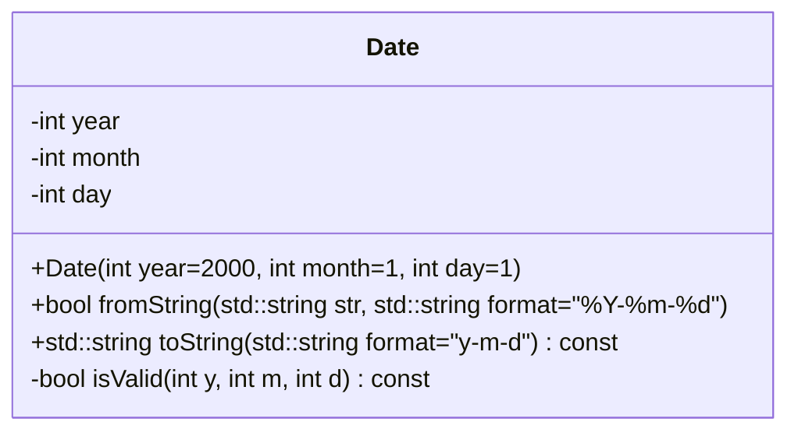

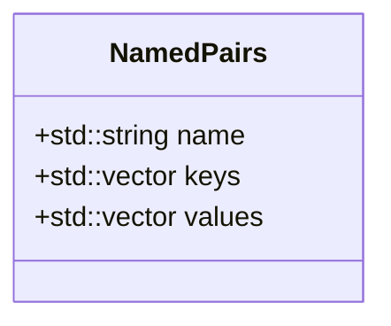

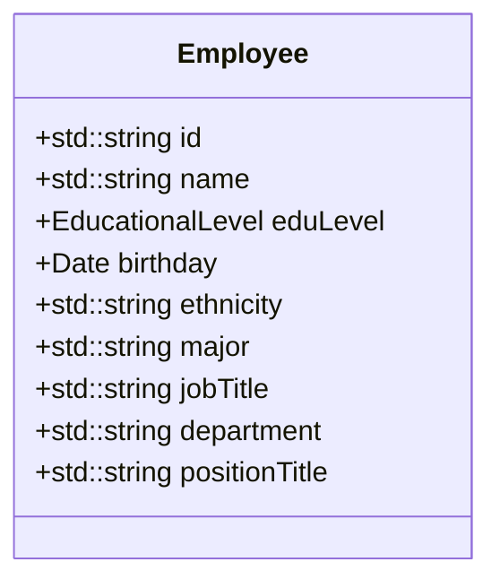

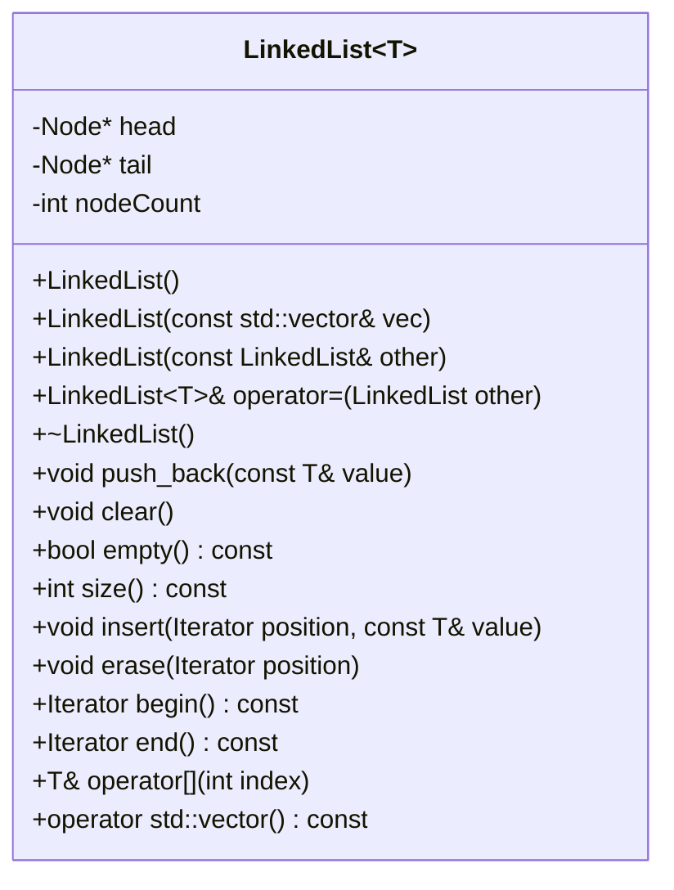

```mermaid
classDiagram
class LinkedList~T~::Node {
	+T data
	+Node* prev
	+Node* next
	+Node(const T& value)
}
```

```mermaid
classDiagram
class LinkedList~T~::Iterator {
	+Iterator(Node* position=nullptr)
	+Iterator operator+(int offset) const
	+operator Node*() const
	-Node* node
}
```

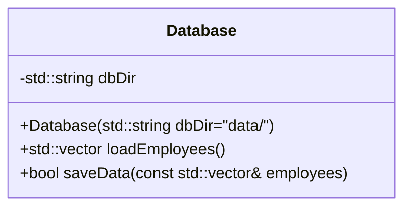

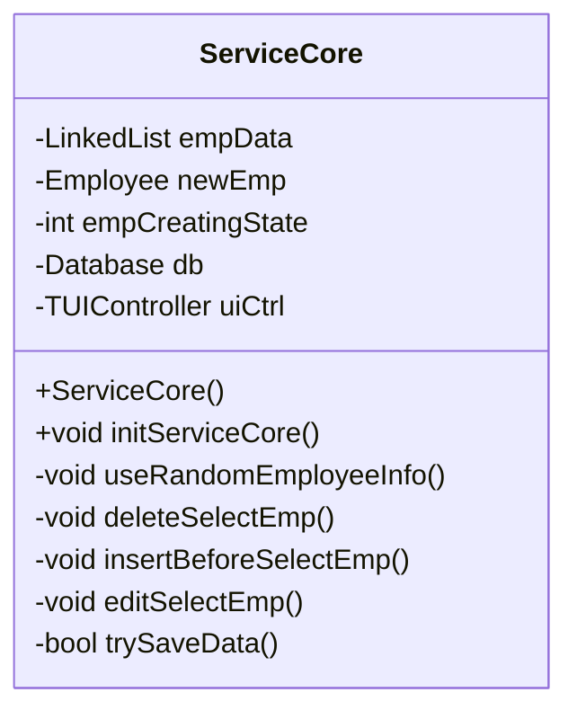

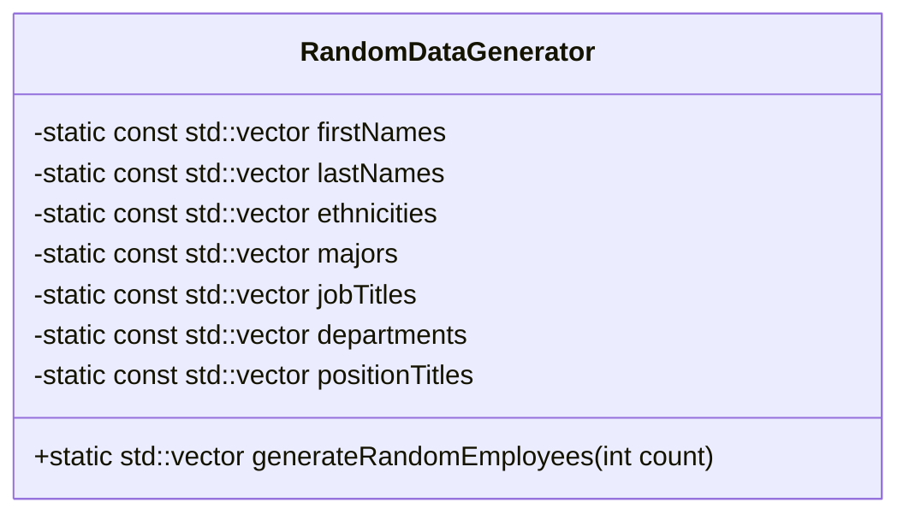

```mermaid
classDiagram
class TUIController {
	+void setupTUI()
	+void bindEmployeeDatasource(std::function<std::vector<Employee>()> dataSource)
	+void bindFuncCallback(std::function<void()> cbRandomEmpInfo, std::function<bool()> cbTrySaveData)
	+void bindQueryPageOperation(const std::vector<TUIPageOperation>& operation)
	+void bindStatsPageOperation(const std::vector<TUIPageOperation>& operation)
	+int getQuerySelectIdx()
	+void callEmpInput(std::string title, Employee& emp)
	-const std::vector<std::string> EducationalLevelStrCN
	-TUIRenderer* uiRenderer
	-TUICHeader* cHeader
	-TUIPQuery* pageQuery
	-TUIPStats* pageStats
	-TUIPInputEmp* pageInputEmp
	-TUIPBase* currentPage
	-std::vector<TUICTableHeader> tableHeader
	-std::function<std::vector<Employee>()> empDatasource
	-std::vector<TUIPageOperation> pageQueryOperations
	-std::vector<TUIPageOperation> pageStatsOperations
	-std::function<void()> cbRandomEmpInfo
	-std::function<void()> cbInputSubmit
	-std::function<bool()> cbTrySaveData
	-int pageIndex
	-void onInputSubmit()
	-void buildQueryTableHeader()
	-void onEvent(TUIEventType key)
	-std::vector<NamedPairs> genStatsData()
	-std::vector<std::reference_wrapper<TUICBase>> onUpdate()
	-std::vector<std::vector<std::string>> convEmpDataToTable()
	-void switchPage(TUIPBase* tarPage)
	-std::string convEduLevelToCNStr(EducationalLevel level)
}
```

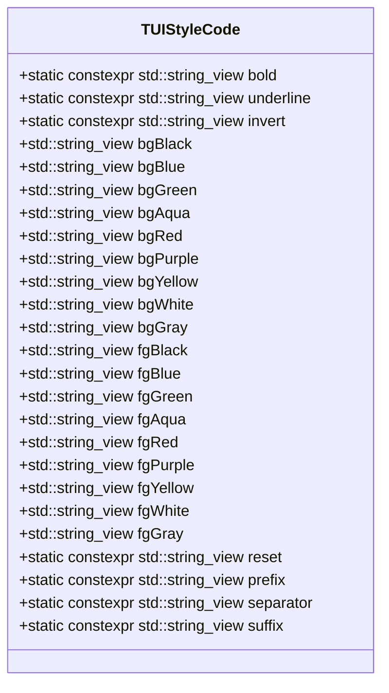

```mermaid
classDiagram
class TUIPageOperation {
	+std::string_view name
	+int keyHintIdx
	+TUIEventType triggerEvent
	+std::function<void()> action
}
```

```mermaid
classDiagram
class TUIRenderer {
	+TUIRenderer(std::function<void(TUIEventType)> onEvent=nullptr, std::function<std::vector<std::reference_wrapper<TUICBase>>()> onUpdate=nullptr)
	+void updatePage()
	+int renderLoop()
	-void renderBlocks(const std::vector<std::vector<TUIBlock>>& blocks)
	-const std::string_view cursorResetCode
	-const std::string_view cursorMoveCode
	-const std::string_view clearScreenCode
	-const std::string_view clearScreenAfterCode
	-const std::string_view clearLineAfterCode
	-const std::string_view hideCursorCode
	-const std::string_view showCursorCode
	-int lastTerminalWidth
	-std::vector<std::vector<TUIBlock>> lastFrame
	-std::function<void(TUIEventType)> onEvent
	-std::function<std::vector<std::reference_wrapper<TUICBase>>()> onUpdate
}
```

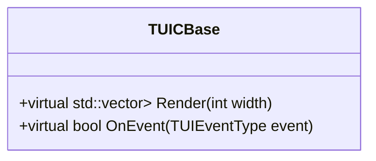

```mermaid
classDiagram
class TUICButton {
	+TUICButton(std::string label, std::function<void()> onClick)
	+void Focus()
	+void Unfocus()
	+std::vector<std::vector<TUIBlock>> Render(int width)
	+bool OnEvent(TUIEventType event)
	-bool focused
	-std::string label
	-std::function<void()> onClick
}
```

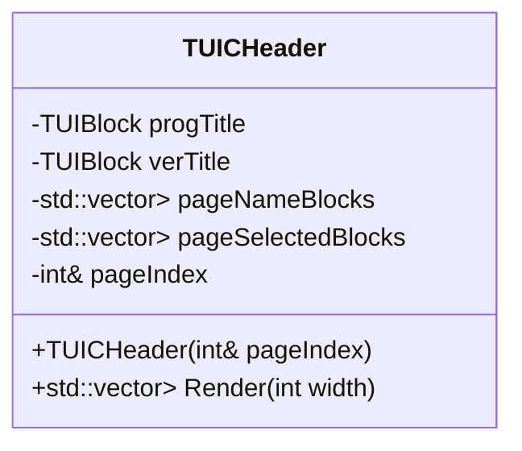

```mermaid
classDiagram
class TUICInput {
	+TUICInput(std::string prompt, std::string& inputBuffer, int promptWidth=0, std::function<std::string(std::string)> validator=nullptr, std::vector<std::string> choices={}, bool enableCustomInput=true)
	+TUICInput(std::string prompt, std::string& inputBuffer, int defaultChoiceIdx, int promptWidth=0, std::function<std::string(std::string)> validator=nullptr, std::vector<std::string> choices={}, bool enableCustomInput=true)
	+std::vector<std::vector<TUIBlock>> Render(int width)
	+void Focus()
	+bool isInputting() const
	+void Unfocus(bool needValidate=true)
	+bool OnEvent(TUIEventType event)
	-bool enableCustomInput
	-std::string prompt
	-std::string errPrompt
	-int promptWidth
	-std::function<std::string(std::string)> validator
	-std::vector<std::string> choices
	-int currentChoiceIdx
	-bool inputting
	-bool focused
	-int charRemainBytes
	-std::string& inputBuffer
	-bool rollChoice(bool forward)
	-void validate()
}
```

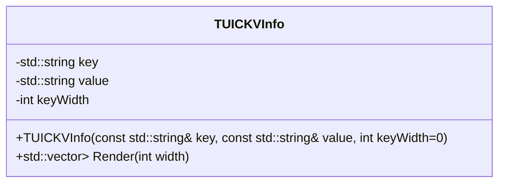

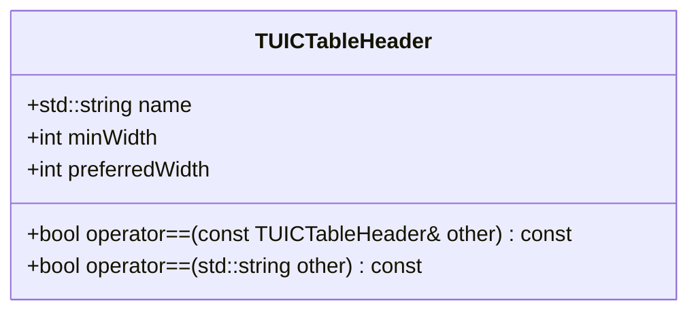

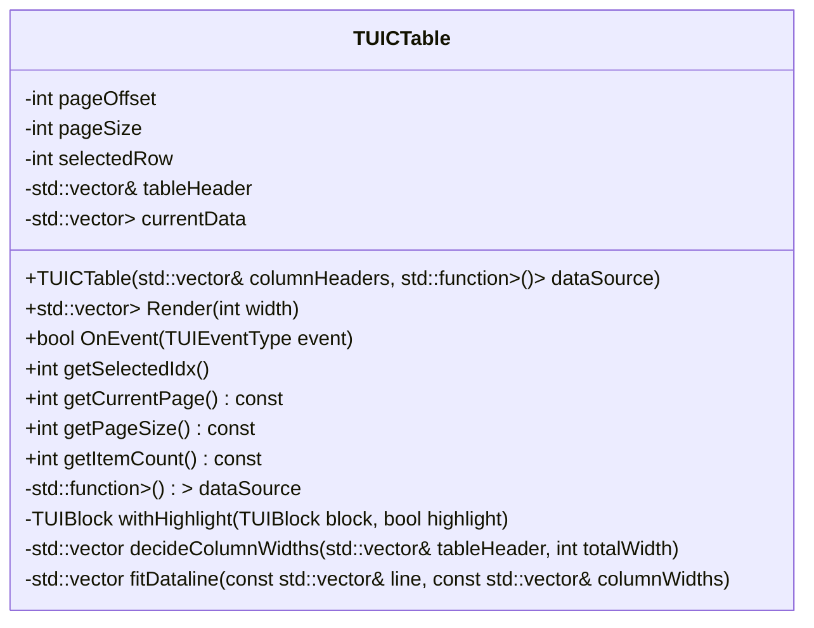

```mermaid
classDiagram
class TUICTitle {
	+TUICTitle(const std::string& titleText, const std::vector<TUIPageOperation>& operations)
	+std::vector<std::vector<TUIBlock>> Render(int width)
	-const std::string& titleText
	-const std::vector<TUIPageOperation> operations
}
```

```mermaid
classDiagram
class TUIPBase {
	+virtual std::vector<std::reference_wrapper<TUICBase>> getComponents()
	+virtual bool OnEvent(TUIEventType event)
}
```

```mermaid
classDiagram
class TUIPInputEmp {
	+TUIPInputEmp(Employee& emp, std::function<void()> submitCallback, std::string title="Insert Employee")
	+std::vector<std::reference_wrapper<TUICBase>> getComponents()
	+bool OnEvent(TUIEventType event)
	-Employee& emp
	-std::string title
	-TUICTitle* titleComponents
	-TUICButton* submitButton
	-std::vector<std::reference_wrapper<TUICInput>> inputComponents
	-std::function<void()> cbInputSubmit
	-int currentFocusIdx
	-bool isComplete
	-bool rollInputFocus(bool forward)
	-std::string validateLength(std::string input, int maxLength)
	-const std::vector<std::string> eduLevelChoices
	-std::string eduLvlBuf
	-std::string birthdayBuf
	-std::string validateEduLevel(std::string input)
	-std::string validateBirthday(std::string input)
	-void completionCheck()
}
```

```mermaid
classDiagram
class TUIPQuery {
	+TUIPQuery(std::vector<TUICTableHeader>& headers, std::function<std::vector<std::vector<std::string>>()> source, const std::vector<TUIPageOperation>& operations)
	+std::vector<std::reference_wrapper<TUICBase>> getComponents()
	+bool OnEvent(TUIEventType event)
	+int getSelectedIdx()
	+void setNormalMode()
	+void setSearchMode()
	+void setSortMode()
	-TUICTitle* titleComponent
	-TUICTable* tableComponent
	-TUICTable* tempTable
	-TUICInput* searchInput
	-TUICInput* sortSelect
	-std::vector<TUICTableHeader>& dataHeaders
	-std::function<std::vector<std::vector<std::string>>()> dataSource
	-std::string title
	-const std::vector<TUIPageOperation> operations
	-bool inputting
	-Mode currentMode
	-std::string searchKeyword
	-std::string sortKey
	-std::vector<int> tempDataMapping
	-std::vector<std::vector<std::string>> getFilteredData()
	-std::vector<std::vector<std::string>> getSortedData()
	-std::vector<std::string> getHeaderNames()
	-std::string onInputSubmit()
	-void refreshTitle()
}
```

```mermaid
classDiagram
class TUIPStats {
	+TUIPStats(std::function<std::vector<NamedPairs>()> dataSource)
	+std::vector<std::reference_wrapper<TUICBase>> getComponents()
	+bool OnEvent(TUIEventType event)
	-std::string title
	-const std::vector<TUIPageOperation> operations
	-TUICTitle* titleComponents
	-TUICInput* selectComponents
	-TUICBase* blankComponent
	-std::string selectedStat
	-std::vector<TUICKVInfo*> statInfoComponents
	-std::function<std::vector<NamedPairs>()> statsDataSource
	-std::vector<std::string> getStatChoices()
}
```

```mermaid
classDiagram
class TUIBlock {
	+static void initStyleCode()
	+TUIBlock(bool isInput, std::string str="", Color fColor=Color::Default, Color bColor=Color::Default, int16_t styleFlags=0)
	+TUIBlock(std::string ch, Color fColor=Color::Default, Color bColor=Color::Default, int16_t styleFlags=0)
	+TUIBlock(std::string_view ch, Color fColor=Color::Default, Color bColor=Color::Default, int16_t styleFlags=0)
	+TUIBlock(const char* ch, Color fColor=Color::Default, Color bColor=Color::Default, int16_t styleFlags=0)
	+TUIBlock(std::string_view ch, int count, Color fColor=Color::Default, Color bColor=Color::Default, int16_t styleFlags=0)
	+bool operator==(const TUIBlock& other) const
	+bool operator!=(const TUIBlock& other) const
	+std::vector<TUIBlock> operator+(const TUIBlock& other) const
	+std::vector<TUIBlock> operator+(std::vector<TUIBlock> other) const
	+std::vector<TUIBlock> operator*(int count) const
	+std::string_view convertColorCode(Color color, bool isBackground=false) const
	+std::string convertStyleSet() const
	+int width() const
	+static int width(std::string str)
	+static int width(std::vector<TUIBlock> blocks)
	+static std::vector<int> charByteIdx(std::string str)
	+static int getCharWidth(char32_t cp)
	+static int getCharBytes(unsigned char first)
	+static void delLastChar(std::string& str)
	+void setStyleFlag(Flag flag)
	+bool isInputBlock() const
	-bool isInput
	-std::string str
	-int16_t styleFlags
	-Color fColor
	-Color bColor
	-static TUIStyleCode styleCode
}
```
