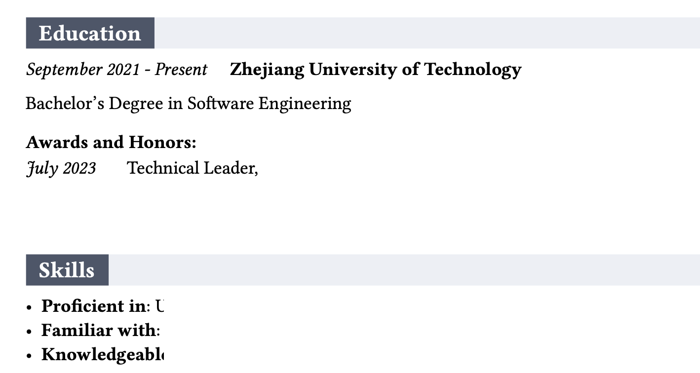

# 团队合作与职业规划（软外）

## 教材

老师会发电子版的英文教材

## 上课

上课经常会点到。老师上课讲的内容和考试还是关系比较大的，他也明确说了我们没有期末考点总结课，中方的课去听听还是有好处的。

## 作业

有两次个人作业，一次是写一个英文的简历，一次是写团队合作的案例分析

英文简历里面，个人的荣誉不重要，重要的是写完整老师要求的三个点，skills, values, interests。其他要求具体问老师。这个作业对简历的格式非常看中，简历需要打印上交，提下老师不会公开通知的细节，但是是他的偏好：简历里面框框条条的要有背景色，文档最好是双色（建议彩色打印，打印纸要厚一点有质感）这里是一个参考

团队合作案例分析这个作业，是完全结合书本附录内容来分析的，没什么可以投机取巧的。这个分析题，在期末考试会考。

## 期末考试

课程 ppt 中方老师会在开学就发完，考试内容完全来自 ppt，背书就完了。有两次期末考的样卷提供。
